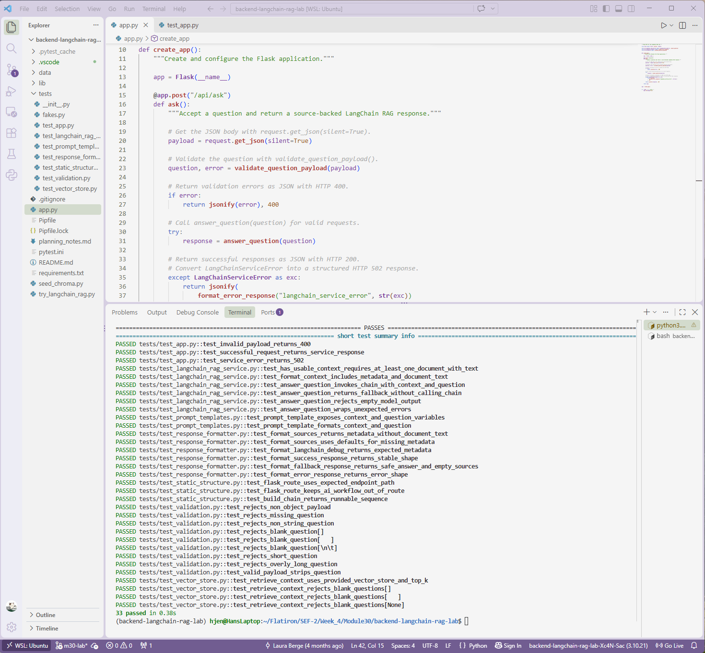

# Lab: Refactor a Flask RAG API with LangChain

**Completed Sept 29, 2026**

## Overview

A Flask API that answers engineers' incident questions using **Retrieval-Augmented Generation (RAG)**, organized with **LangChain** components. It retrieves relevant runbook chunks from a Chroma vector store, asks a local Ollama model to answer using only that approved context, and returns the answer with its sources and LangChain debug metadata.



## How It Works

Every request to `POST /api/ask` runs through the same pipeline:

```
question → validate → retrieve runbook chunks → (fallback if none) → format context → prompt | model | parser → answer + sources + debug metadata
```

The model step is a LangChain chain:

```
ChatPromptTemplate | ChatOllama | StrOutputParser
```

Each stage lives in its own module, so it can be tested and changed on its own:

| Module | Responsibility |
| --- | --- |
| `app.py` | Flask route: reads the request, validates it, delegates to the service, and maps results to HTTP status codes |
| `lib/config.py` | Model names, Chroma path, collection name, `top_k`, and question length limits |
| `lib/validation.py` | Rejects non-object, missing, non-string, blank, too-short, or too-long questions |
| `lib/vector_store.py` | Builds `OllamaEmbeddings` and the `Chroma` store, and retrieves scored chunks with `similarity_search_with_score` |
| `lib/prompt_templates.py` | Builds a `ChatPromptTemplate` that restricts the model to approved context |
| `lib/langchain_rag_service.py` | Runs the workflow, builds the chain, handles fallback, and wraps failures in `LangChainServiceError` |
| `lib/response_formatter.py` | Builds success, fallback, error, source, and debug metadata responses |

## API

### `POST /api/ask`

**Request**

```json
{ "question": "When should we publish a status page update?" }
```

**Success (200)**: an answer grounded in the retrieved runbooks, source metadata for review, and LangChain debug info.

```json
{
  "answer": "A status page update should be published when an incident affects customer-facing availability, payment completion, data exports, or login.",
  "sources": [
    {
      "source_id": "REL-120",
      "title": "Status Page Update Guide",
      "category": "Reliability",
      "section": "Customer Communication",
      "chunk_id": "chunk-rel-120-a",
      "distance": 0.6164
    }
  ],
  "langchain": {
    "chain_expression": "ChatPromptTemplate | ChatOllama | StrOutputParser",
    "retrieved_count": 3,
    "retrieved_chunk_ids": ["chunk-rel-120-a", "chunk-data-410-a", "chunk-rel-101-a"],
    "top_k": 3,
    "context_characters": 1250,
    "fallback": false,
    "score_type": "Chroma distance; lower usually means closer in this lesson setup"
  }
}
```

**Fallback (200)**: when no usable context is found, the chain is never invoked, and the API returns a safe message with no sources.

```json
{
  "answer": "I do not have enough approved runbook context to answer that reliably.",
  "sources": [],
  "langchain": { "fallback": true, "retrieved_count": 0 }
}
```

**Invalid input (400)**: one of `invalid_request`, `missing_question`, `invalid_question`, `empty_question`, `short_question`, or `long_question`.

```json
{ "error": "short_question", "message": "Question must be at least 3 characters." }
```

**Service failure (502)**: Chroma or Ollama failed, or the model returned an empty answer.

```json
{ "error": "langchain_service_error", "message": "LangChain RAG workflow failed: ..." }
```

## Design Decisions

- **LangChain organizes, but doesn't replace, the RAG steps:** Retrieval, context formatting, fallback, and source attribution are still explicit code. LangChain handles the prompt → model → parser sequence and standardizes the vector store and model interfaces.
- **Grounding:** The system prompt tells the model to answer only from approved retrieved context, not to invent policies, procedures, or incident steps, and to say when context is insufficient.
- **Fallback before generation:** If retrieval returns no usable text, the service returns the fallback response without invoking the chain, so the model has no chance to guess.
- **Source attribution without data exposure:** Sources include runbook IDs, sections, chunk IDs, and distances for review, but never the full chunk text.
- **Inspectable debug metadata:** Each response reports the chain expression, components, retrieved chunk IDs, context size, and fallback status, which offsets how a chain can hide intermediate steps.
- **One error type for the service:** Retrieval failures, model failures, and empty answers all become `LangChainServiceError`, so the route handles them with a single `except` and a 502.
- **Dependency injection:** `answer_question()` and `retrieve_context()` accept optional fake vector stores and chains, so the full workflow is tested without Chroma or Ollama.
- **Lazy imports:** LangChain, Chroma, and Ollama are imported inside the builder functions, so the tests run without loading those services.

## Known Limitations

Observed while running the pipeline locally:

- `top_k` always returns results, even loosely related ones, so fallback rarely triggers with a seeded store. A distance threshold would let unrelated questions fall back safely.
- The model doesn't always use every relevant chunk; in one run it answered from the Triage section and skipped the higher-ranked Mitigation section.
- Answers sometimes reference internal labels like "Context 1." Prompting the model to cite Source IDs would make them clearer.
- The model sometimes referenced internal labels like "Context 1" and skipped relevant chunks. The prompt now asks it to combine all relevant contexts and cite Source IDs, which improved answers in local testing.

## Setup

Requires Python 3.10 and `pipenv`.

```bash
pipenv install
pipenv shell
```

## Running The Tests

```bash
pytest -q
```

All 33 tests pass. They use fake vector stores and chains, so they don't need Ollama, a seeded database, or internet access.

## Trying It Locally (optional)

This requires [Ollama](https://ollama.com) installed and running.

1. Download the embedding and chat models:

```bash
ollama pull embeddinggemma
ollama pull llama3.2
```

2. Load the runbooks into Chroma. This creates a local `chroma_db/` folder, which is git-ignored.

```bash
python seed_chroma.py
```

3. Try the service directly, without Flask:

```bash
python try_langchain_rag.py "When should we publish a status page update?"
```

4. Start the API:

```bash
flask --app app run --debug
```

5. In a second terminal, ask a question:

```bash
curl -i -X POST http://127.0.0.1:5000/api/ask \
  -H "Content-Type: application/json" \
  -d '{"question": "What should I do if checkout API errors spike right after a release?"}'
```

## Technology Used

Python 3.10 · Flask · LangChain · Chroma · Ollama (llama3.2, embeddinggemma) · pytest